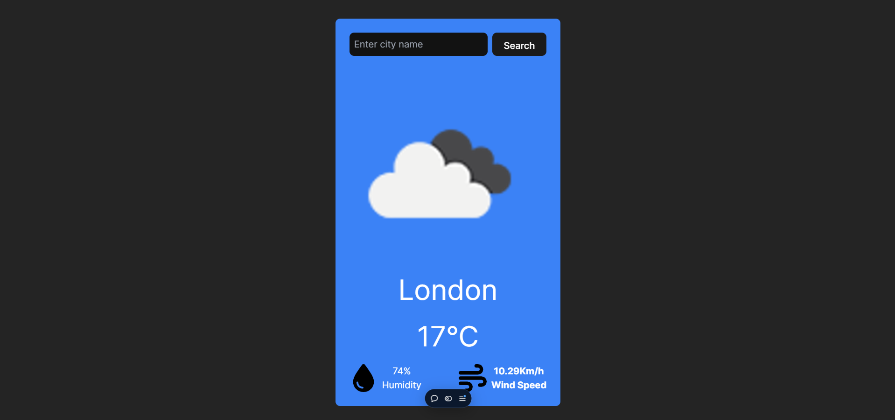

# Weather App

An interactive weather app built with Reactjs. Enjoy a clean and responsive design with essential informations related to the searched city.

## Features

- Responsive Design : Looks great on both mobile and desktop devices.
- Controls : Has an input field which takes city in input and provides result based on it.


## Demo

Check out the live demo [here](https://codtech-weather-app.vercel.app/)

## Screenshots




## Installation

1. Clone the repository : 

```bash
  git clone https://github.com/siddhantmishra0/CODTECH_Weather_App.git
```

2. Open index.html in your browser.
## Tech Stack

- Tailwind CSS: Used for styling.
- Reactjs: Used for structuring as well as functioning using jsx syntax
- Font Awesome: For incorporating visually appealing icons.

